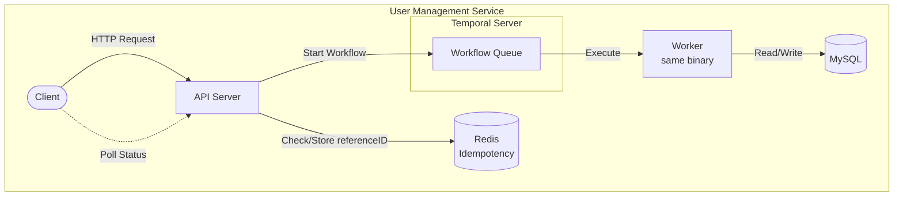
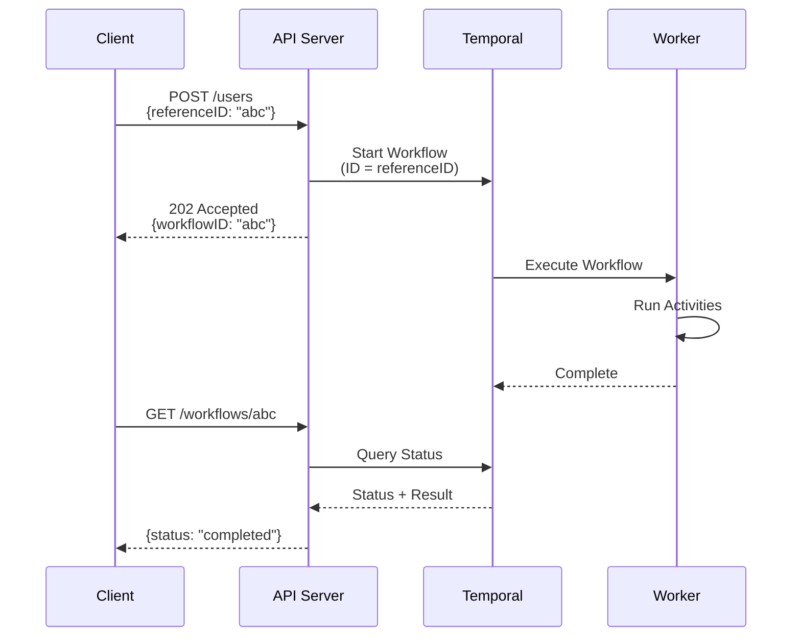

# User Management Service

A user management API with idempotent operations powered by Temporal workflows.

## Overview

This service exposes REST APIs for user management:
- **Create User** - Register new users
- **Get User** - Retrieve user details  
- **Flag User** - Apply flags to users (fraud, suspended, etc.)
- **Lift Flag** - Remove flags from users

All mutating operations are **idempotent** (via `referenceID` in payload) and execute as **Temporal workflows** in the background.

## Architecture

```
┌─────────────────────────────────────────────────────────────────────────────┐
│                                                                             │
│  ┌──────────┐      ┌─────────────────┐      ┌──────────────────────────┐   │
│  │          │      │                 │      │     Temporal Server      │   │
│  │  Client  │─────▶│   API Server    │─────▶│                          │   │
│  │          │      │                 │      │  ┌────────────────────┐  │   │
│  └──────────┘      └─────────────────┘      │  │  Workflow Queue    │  │   │
│       │                    │                │  └─────────┬──────────┘  │   │
│       │                    │                └────────────┼─────────────┘   │
│       │                    │                             │                 │
│       │            ┌───────▼───────┐                     │                 │
│       │            │     Redis     │            ┌────────▼─────────┐       │
│       │            │ (Idempotency) │            │      Worker      │       │
│       │            └───────────────┘            │  (same binary)   │       │
│       │                                         └────────┬─────────┘       │
│       │                                                  │                 │
│       │         poll status                     ┌────────▼─────────┐       │
│       └────────────────────────────────────────▶│      MySQL       │       │
│                                                 └──────────────────┘       │
│                                                                             │
└─────────────────────────────────────────────────────────────────────────────┘
```

<details>
<summary>Mermaid version</summary>



</details>

## API Flow

```
  Client                    API Server                 Temporal                  Worker
    │                           │                         │                        │
    │  POST /users              │                         │                        │
    │  {referenceID: "abc"}     │                         │                        │
    ├──────────────────────────▶│                         │                        │
    │                           │                         │                        │
    │                           │  Start Workflow         │                        │
    │                           │  (ID = referenceID)     │                        │
    │                           ├────────────────────────▶│                        │
    │                           │                         │                        │
    │  202 Accepted             │                         │   Execute              │
    │  {workflowID: "abc"}      │                         │   Workflow             │
    │◀──────────────────────────┤                         ├───────────────────────▶│
    │                           │                         │                        │
    │                           │                         │                        │
    │  GET /workflows/abc       │                         │                        │
    ├──────────────────────────▶│  Query Status           │                        │
    │                           ├────────────────────────▶│                        │
    │  {status: "completed"}    │                         │                        │
    │◀──────────────────────────┤                         │                        │
    │                           │                         │                        │
```

<details>
<summary>Mermaid version</summary>



</details>

## API Endpoints

| Method | Endpoint | Description |
|--------|----------|-------------|
| `POST` | `/api/v1/users` | Create user (workflow) |
| `GET` | `/api/v1/users/:id` | Get user |
| `POST` | `/api/v1/users/:id/flags` | Add flag (workflow) |
| `DELETE` | `/api/v1/users/:id/flags/:type` | Remove flag (workflow) |
| `GET` | `/api/v1/workflows/:id` | Poll workflow status |

## Quick Start

```bash
# Start all services
make up

# Run migrations
make migrate-up

# Run the application
make run
```

**Access:** http://localhost:8080

## License

MIT
